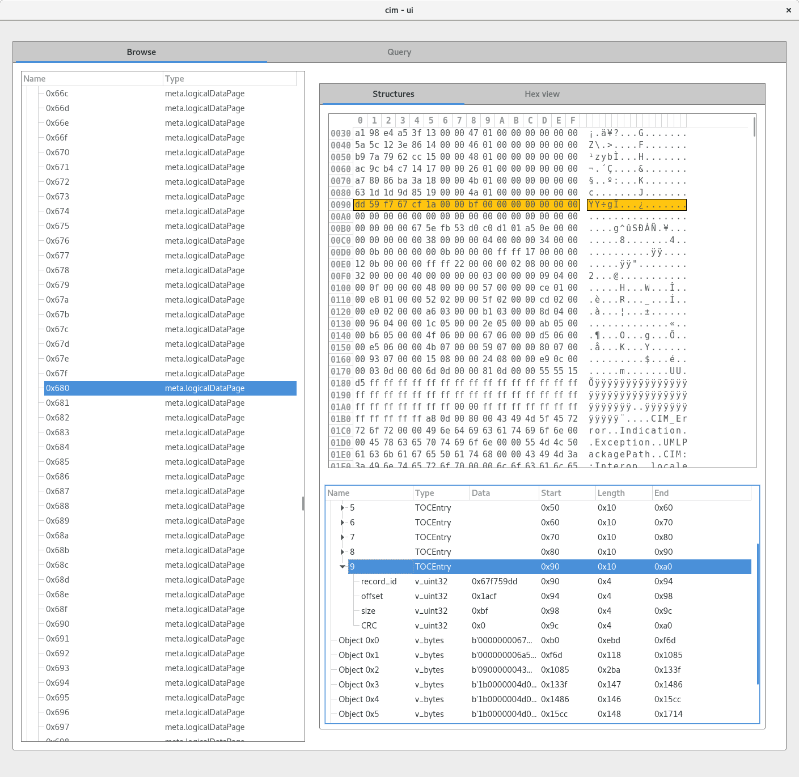
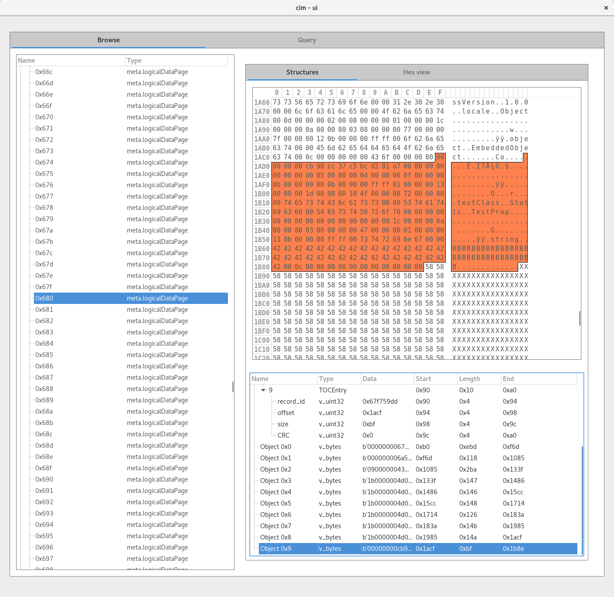
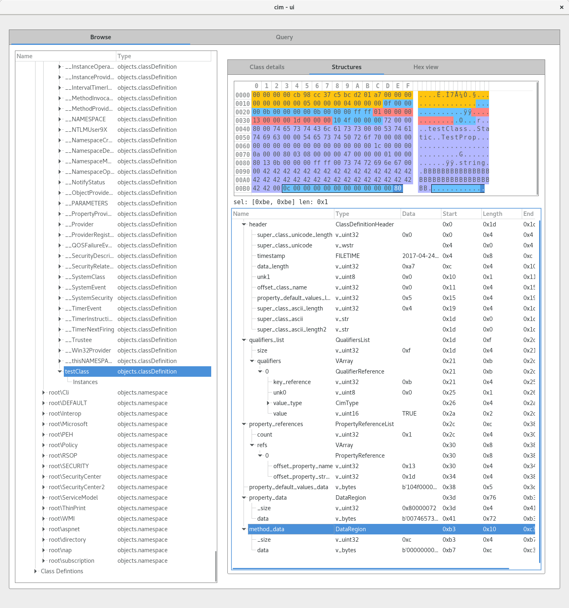

# tutorial: recovering data from an overwritten class


consider the example data available in [tests/repos/win7/overwritten-instance](../tests/repos/win7/overwritten-instance).
it simulates an actor that creates a malicious WMI class and uses it to store data.
the "malicious" script [overwrite_test1.ps1](../tests/repos/win7/overwritten-instance/overwrite_test1.ps1) does the following:
  1. creates a static class named `testClass`,
  2. creates the property `TestProp`,
  3. stores some data in it,
  4. overwrites the prop with longer data,
  5. and overwrites the prop with shorter data

we might wonder "do we have any change at recovering the original payloads?". let's find out!

first, here is the source code to the "malicious" script:

```powershell
$scope = New-Object System.Management.ManagementScope
$scope.Path = "\\.\root\CIMv2"

$newClass = New-Object System.Management.ManagementClass($scope, [String]::Empty, $null);
$newClass["__CLASS"] = "testClass";
$newClass.Qualifiers.Add("Static", $true)

$newClass.Properties.Add("TestProp", [System.Management.CimType]::String, $false)
$newClass.Properties["TestProp"].Qualifiers.Add("Key", $true)
$newClass.Properties["TestProp"].Value = "AAAAAAAAAAAAAAAAAAAAAAAAAAAAAAAAAAAAAAAAAAAAAAA"

$newClass.Put() | Out-Null
Start-Sleep 5

$newClass.Properties["TestProp"].Value = "XXXXXXXXXXXXXXXXXXXXXXXXXXXXXXXXXXXXXXXXXXXXXXXXXXXXXXXXXXXXXXXXXXXXXXXXXXXXXXXXXXXXXXXXXXXXXXXXXXXXXXXXXXXXXXXXXXXXXXXXXXXXXXXXXXXXXXXXXXXXXXXXXXXXXXXXXXXXXXXXXXXXXXXXXXXXXXXXXXXXXXXXXXXXXXXXXXXXXXXXXXXXXXXXXXXXXXXXXXXXXXXXXXXXXXXXXXXXXXXXXXXXXXXXXXXXXXXXXXXXXXXXXXXXXXXXXXXXXXXXXXXXXXXXXXXXXXXXXXXXXXXXXXXXXXXXXXXXXXXXXXXXXXXXXXXXXXXXXXXXXXXXXXXXXXXXXXXXXXXXXXXXXXXXXXXXXXXXXXXXXXXXXXXXXXXXXXXXXXXXXXXXXXXXXXXXXXXXXXXXXXXXXXXXXXXXXXXXXXXXXXXXXXXXXXXXXXXXXXXXXXXXXXXXXXXXXXXXXXXXXXXXXXXXXXXXXXXXXXXXXXXXXXXXXXXXXXXXXXXXXXXXXXXXXXXXXXXXXXXXXXXXXXXXXXXXXXXXXXXXXXXXXXXXXXXXXXXXXXXXXXXXXXXXXXXXXXXXXXXXXXXXXXXXXXXXXXXXXXXXXXXXXXXXXXXXXXXXXXXXXXXXXXXXXXXXXXXXXXXXXXXXXXXXXXXXXXXXXXXXXXXXXXXXXXXXXXXXXXXXXXXXXXXXXXX"

$newClass.Put() | Out-Null

Start-Sleep 5

$newClass.Properties["TestProp"].Value = "BBBBBBBBBBBBBBBBBBBBBBBBBBBBBBBBB"

$newClass.Put() | Out-Null
```

now, let's challenge ourselves and assume all we know is the name of the malicious class: `testClass`.
can we also find the active class and its default property value (`BBBBBB...`)?

we begin by checking if there any related data still in the repo?

```sh
$ strings -e l OBJECTS.DATA | grep testClass
$ strings -e s OBJECTS.DATA | grep testClass
testClass
testClass
testClass
```

there is! some data *does* remain in the repository.
where is it?

```sh
$ python find_bytes.py . "testClass"
found hit on physical page 0x4b4 at offset 0x1b11
  mapped to logical page 0x680
  hit on object contents at entry index 0x9 id 0x67f759dd
  referred to by key NS_68577372C66A7B20658487FBD959AA154EF54B5F935DCC5663E9228B44322805/CD_92128A4E1ADC48BA9AA4C2DD8352632FEB34D1735315ACF5FDF17AE02CA83513.1664.1744263645.191
found hit on physical page 0x4ba at offset 0x1da9
  mapped to logical page 0x647
  hit in page slack space
found hit on physical page 0x4d5 at offset 0x1b11
  this page not mapped to a logical page (unallocated page)
```

you can learn more about searching wmi structures in the section on [finding bytes](./find-bytes.md).

anyways, let's walk through how to interpret these hits.


### active data

here are our results to interpret:

```
found hit on physical page 0x4b4 at offset 0x1b11
  mapped to logical page 0x680
  hit on object contents at entry index 0x9 id 0x67f759dd
  referred to by key NS_68577372C66A7B20658487FBD959AA154EF54B5F935DCC5663E9228B44322805/CD_92128A4E1ADC48BA9AA4C2DD8352632FEB34D1735315ACF5FDF17AE02CA83513.1664.1744263645.191
```

our strategy will be to:
  1. review the raw page containing the hit (logical page 0x680)
  2. inspect the table of contents (TOC) and object buffer with the hit (index 0x9)
  3. try to find the object in the active repository structure (identified by that long key)

first, the data is in an active page, which is a logical page (0x680) that has a valid mapping to a physical page (0x4b4).
let's see what the physical page looks like:

```
 $ python dump_page.py --addressing_mode physical . 0x4b4 | xxd

00000000: 9e3f 0000 b000 0000 bd0e 0000 0000 0000  .?..............
00000010: d546 0000 6d0f 0000 1801 0000 0000 0000  .F..m...........
00000020: 3649 0000 8510 0000 ba02 0000 0000 0000  6I..............
00000030: a198 e4a5 3f13 0000 4701 0000 0000 0000  ....?...G.......
00000040: 5a5c 123e 8614 0000 4601 0000 0000 0000  Z\.>....F.......
00000050: b97a 7962 cc15 0000 4801 0000 0000 0000  .zyb....H.......
00000060: ac9c b4c7 1417 0000 2601 0000 0000 0000  ........&.......
00000070: a780 86ba 3a18 0000 4b01 0000 0000 0000  ....:...K.......
00000080: 631d 1d9d 8519 0000 4a01 0000 0000 0000  c.......J.......
00000090: dd59 f767 cf1a 0000 bf00 0000 0000 0000  .Y.g............
000000a0: 0000 0000 0000 0000 0000 0000 0000 0000  ................
000000b0: 0000 0000 675e fb53 d0c0 d101 a50e 0000  ....g^.S........
000000c0: 0000 0000 0038 0000 0004 0000 0034 0000  .....8.......4..
000000d0: 000b 0000 0000 0b00 0000 ffff 1700 0000  ................
000000e0: 120b 0000 00ff ff22 0000 0002 0800 0000  ......."........
000000f0: 3200 0000 4000 0000 0003 0000 0009 0400  2...@...........
00000100: 000f 0000 0048 0000 0057 0000 00ce 0100  .....H...W......
00000110: 00e8 0100 0052 0200 005f 0200 00cd 0200  .....R..._......
00000120: 00e0 0200 00a6 0300 00b1 0300 008d 0400  ................
00000130: 0096 0400 001c 0500 002e 0500 00ab 0500  ................
00000140: 00b6 0500 004f 0600 0067 0600 00d5 0600  .....O...g......
00000150: 00e5 0600 004b 0700 0059 0700 0080 0700  .....K...Y......
00000160: 0093 0700 0015 0800 0024 0800 00e9 0c00  .........$......
...
00001a90: 0000 000a 0000 8003 0800 0000 7700 0000  ............w...
00001aa0: 7f00 0000 120b 0000 00ff ff00 6f62 6a65  ............obje
00001ab0: 6374 0000 456d 6265 6464 6564 4f62 6a65  ct..EmbeddedObje
00001ac0: 6374 000c 0000 0000 0043 6f00 0000 8000  ct.......Co.....
00001ad0: 0000 00cb 98cc 37c5 bcd2 01a7 0000 0000  ......7.........
00001ae0: 0000 0000 0500 0000 0400 0000 0f00 0000  ................
00001af0: 0b00 0000 000b 0000 00ff ff01 0000 0013  ................
00001b00: 0000 001d 0000 0010 4f00 0000 7200 0080  ........O...r...
00001b10: 0074 6573 7443 6c61 7373 0000 5374 6174  .testClass..Stat
00001b20: 6963 0000 5465 7374 5072 6f70 0008 0000  ic..TestProp....
00001b30: 0000 0000 0000 0000 0000 001c 0000 000a  ................
00001b40: 0000 8003 0800 0000 4700 0000 0100 0080  ........G.......
00001b50: 130b 0000 00ff ff00 7374 7269 6e67 0000  ........string..
00001b60: 4242 4242 4242 4242 4242 4242 4242 4242  BBBBBBBBBBBBBBBB
00001b70: 4242 4242 4242 4242 4242 4242 4242 4242  BBBBBBBBBBBBBBBB
00001b80: 4200 0c00 0000 0000 0000 0000 0080 5858  B.............XX
00001b90: 5858 5858 5858 5858 5858 5858 5858 5858  XXXXXXXXXXXXXXXX
00001ba0: 5858 5858 5858 5858 5858 5858 5858 5858  XXXXXXXXXXXXXXXX
00001bb0: 5858 5858 5858 5858 5858 5858 5858 5858  XXXXXXXXXXXXXXXX
00001bc0: 5858 5858 5858 5858 5858 5858 5858 5858  XXXXXXXXXXXXXXXX
00001bd0: 5858 5858 5858 5858 5858 5858 5858 5858  XXXXXXXXXXXXXXXX
00001be0: 5858 5858 5858 5858 5858 5858 5858 5858  XXXXXXXXXXXXXXXX
00001bf0: 5858 5858 5858 5858 5858 5858 5858 5858  XXXXXXXXXXXXXXXX
00001c00: 5858 5858 5858 5858 5858 5858 5858 5858  XXXXXXXXXXXXXXXX
00001c10: 5858 5858 5858 5858 5858 5858 5858 5858  XXXXXXXXXXXXXXXX
00001c20: 5858 5858 5858 5858 5858 5858 5858 5858  XXXXXXXXXXXXXXXX
00001c30: 5858 5858 5858 5858 5858 5858 5858 5858  XXXXXXXXXXXXXXXX
00001c40: 5858 5858 5858 5858 5858 5858 5858 5858  XXXXXXXXXXXXXXXX
00001c50: 5858 5858 5858 5858 5858 5858 5858 5858  XXXXXXXXXXXXXXXX
00001c60: 5858 5858 5858 5858 5858 5858 5858 5858  XXXXXXXXXXXXXXXX
00001c70: 5858 5858 5858 5858 5858 5858 5858 5858  XXXXXXXXXXXXXXXX
00001c80: 5858 5858 5858 5858 5858 5858 5858 5858  XXXXXXXXXXXXXXXX
00001c90: 5858 5858 5858 5858 5858 5858 5858 5858  XXXXXXXXXXXXXXXX
00001ca0: 5858 5858 5858 5858 5858 5858 5858 5858  XXXXXXXXXXXXXXXX
00001cb0: 5858 5858 5858 5858 5858 5858 5858 5858  XXXXXXXXXXXXXXXX
```

and here's how we could fetch the logical page. it contains exactly the same bytes.
these two page addresses refer to the same underlying data.

```sh
 $ python dump_page.py --addressing_mode logical . 0x680 | xxd
```

next, we can use the graphical repository browser to view the structures.
first, lets look at the table of contents for logical page 0x680.
our string hit was for entry nine, so we review this entry.



note that the TOC entry record ID (`0x67f759dd`) matches the second extension of the index key (`1744263645`) when they have the same base.

next, we can inspect the bytes for this object.
at page offset 0x1b11 is the string match.



this region is the class definition for `testClass` that also contains
 the default value for the `TestProp` property.
we can see that value as the long sequence like `AAAA..`.

following the region, we can also see a long string like `XXXX...`.
this appears to be the old default value for the `TestProp` property.
therefore, we've learned that the CIM repository sometimes attempts to overwrite objects in-place.

since this object is active and referenced within the repository, let's try to find it in the database.
however, first we need to find the name of the object.
this will allow us to navigate the namespace hierarchy and identify the correct class definition.
because we've seen the script, we expect a path like `\\.\CIMV2\testClass`

we need to translate the key to a human readable name.
remember, the key looks like this:

```
NS_68577372C66A7B20658487FBD959AA154EF54B5F935DCC5663E9228B44322805/CD_92128A4E1ADC48BA9AA4C2DD8352632FEB34D1735315ACF5FDF17AE02CA83513.1664.1744263645.191
```

here's how to digest that blob:
  - path components are separated by forward slashes (`/`) and periods (`.`).
  - parts between the periods) tell us that the object:
     - can be found on logical page 1664 (hex: `0x680`),
     - has record ID 1744263645 (hex: `0x67f759dd`), and
     - has length 191 bytes.
  - this path schema (`NS/CD`) indicates there is a class definition (`CD_`) that exists under some namespace (`NS_`).

the specific names of the namespace and class definition are hashed, so we'll build a rainbow table to reverse the hash into something human readable:

```sh
 $ python compute_rainbow_table.py . | grep 68577372C66A7B20658487FBD959AA154EF54B5F935DCC5663E9228B44322805
68577372C66A7B20658487FBD959AA154EF54B5F935DCC5663E9228B44322805        root\CIMV2
 $ python compute_rainbow_table.py . | grep 92128A4E1ADC48BA9AA4C2DD8352632FEB34D1735315ACF5FDF17AE02CA83513
92128A4E1ADC48BA9AA4C2DD8352632FEB34D1735315ACF5FDF17AE02CA83513        testClass
```

the logical path of the WMI object is `\\.\CIMV2:testClass`.
with this path in hand, we can review the class definition object using the graphical repository browser.
note that the browser is parsing the same object data that we manually extracted above.



and parsed into something more readable:

```
classname: testClass
super:
ts: 2017-04-24T06:37:17.790024
qualifiers:
  Static: True
properties:
  name: TestProp
    type: CIM_TYPE_STRING
    index: 0
    level: 0
    offset: 0x0
    qualifiers:
      PROP_QUALIFIER_KEY: True
      PROP_QUALIFIER_TYPE: string
    has default value: True
      is inherited: False
      default value: BBBBBBBBBBBBBBBBBBBBBBBBBBBBBBBBB
layout:
  (0x0)   CIM_TYPE_STRING TestProp
```

this layout and default data is consistent with what we'd expect having seen the script's source.


### unallocated data

here are our results to interpret:

```
found hit on physical page 0x4d5 at offset 0x1b11
  this page not mapped to a logical page (unallocated page)
```

the hit is in an unallocated page.
this means that the `testClass` string was found in a data page that is not mapped to a logical page.
in other words, this was once a valid chunk of data, but now is completely unreferenced.

let's see what this page looks like:

```
 $ python dump_page.py --addressing_mode physical . 0x4d5 | xxd

00000000: 9e3f 0000 b000 0000 bd0e 0000 0000 0000  .?..............
00000010: d546 0000 6d0f 0000 1801 0000 0000 0000  .F..m...........
00000020: 3649 0000 8510 0000 ba02 0000 0000 0000  6I..............
00000030: a198 e4a5 3f13 0000 4701 0000 0000 0000  ....?...G.......
00000040: 5a5c 123e 8614 0000 4601 0000 0000 0000  Z\.>....F.......
00000050: b97a 7962 cc15 0000 4801 0000 0000 0000  .zyb....H.......
00000060: ac9c b4c7 1417 0000 2601 0000 0000 0000  ........&.......
00000070: a780 86ba 3a18 0000 4b01 0000 0000 0000  ....:...K.......
00000080: 631d 1d9d 8519 0000 4a01 0000 0000 0000  c.......J.......
00000090: cd71 026c cf1a 0000 6503 0000 0000 0000  .q.l....e.......
000000a0: 0000 0000 0000 0000 0000 0000 0000 0000  ................
000000b0: 0000 0000 675e fb53 d0c0 d101 a50e 0000  ....g^.S........
000000c0: 0000 0000 0038 0000 0004 0000 0034 0000  .....8.......4..
000000d0: 000b 0000 0000 0b00 0000 ffff 1700 0000  ................
000000e0: 120b 0000 00ff ff22 0000 0002 0800 0000  ......."........
000000f0: 3200 0000 4000 0000 0003 0000 0009 0400  2...@...........
00000100: 000f 0000 0048 0000 0057 0000 00ce 0100  .....H...W......
...
00001ab0: 6374 0000 456d 6265 6464 6564 4f62 6a65  ct..EmbeddedObje
00001ac0: 6374 000c 0000 0000 0043 6f00 0000 8000  ct.......Co.....
00001ad0: 0000 00cb 98cc 37c5 bcd2 014d 0300 0000  ......7....M....
00001ae0: 0000 0000 0500 0000 0400 0000 0f00 0000  ................
00001af0: 0b00 0000 000b 0000 00ff ff01 0000 0013  ................
00001b00: 0000 001d 0000 0010 4f00 0000 1803 0080  ........O.......
00001b10: 0074 6573 7443 6c61 7373 0000 5374 6174  .testClass..Stat
00001b20: 6963 0000 5465 7374 5072 6f70 0008 0000  ic..TestProp....
00001b30: 0000 0000 0000 0000 0000 001c 0000 000a  ................
00001b40: 0000 8003 0800 0000 4700 0000 0100 0080  ........G.......
00001b50: 130b 0000 00ff ff00 7374 7269 6e67 0000  ........string..
00001b60: 5858 5858 5858 5858 5858 5858 5858 5858  XXXXXXXXXXXXXXXX
00001b70: 5858 5858 5858 5858 5858 5858 5858 5858  XXXXXXXXXXXXXXXX
00001b80: 5858 5858 5858 5858 5858 5858 5858 5858  XXXXXXXXXXXXXXXX
00001b90: 5858 5858 5858 5858 5858 5858 5858 5858  XXXXXXXXXXXXXXXX
00001ba0: 5858 5858 5858 5858 5858 5858 5858 5858  XXXXXXXXXXXXXXXX
00001bb0: 5858 5858 5858 5858 5858 5858 5858 5858  XXXXXXXXXXXXXXXX
00001bc0: 5858 5858 5858 5858 5858 5858 5858 5858  XXXXXXXXXXXXXXXX
00001bd0: 5858 5858 5858 5858 5858 5858 5858 5858  XXXXXXXXXXXXXXXX
00001be0: 5858 5858 5858 5858 5858 5858 5858 5858  XXXXXXXXXXXXXXXX
00001bf0: 5858 5858 5858 5858 5858 5858 5858 5858  XXXXXXXXXXXXXXXX
00001c00: 5858 5858 5858 5858 5858 5858 5858 5858  XXXXXXXXXXXXXXXX
00001c10: 5858 5858 5858 5858 5858 5858 5858 5858  XXXXXXXXXXXXXXXX
00001c20: 5858 5858 5858 5858 5858 5858 5858 5858  XXXXXXXXXXXXXXXX
00001c30: 5858 5858 5858 5858 5858 5858 5858 5858  XXXXXXXXXXXXXXXX
00001c40: 5858 5858 5858 5858 5858 5858 5858 5858  XXXXXXXXXXXXXXXX
00001c50: 5858 5858 5858 5858 5858 5858 5858 5858  XXXXXXXXXXXXXXXX
00001c60: 5858 5858 5858 5858 5858 5858 5858 5858  XXXXXXXXXXXXXXXX
00001c70: 5858 5858 5858 5858 5858 5858 5858 5858  XXXXXXXXXXXXXXXX
00001c80: 5858 5858 5858 5858 5858 5858 5858 5858  XXXXXXXXXXXXXXXX
00001c90: 5858 5858 5858 5858 5858 5858 5858 5858  XXXXXXXXXXXXXXXX
00001ca0: 5858 5858 5858 5858 5858 5858 5858 5858  XXXXXXXXXXXXXXXX
00001cb0: 5858 5858 5858 5858 5858 5858 5858 5858  XXXXXXXXXXXXXXXX
00001cc0: 5858 5858 5858 5858 5858 5858 5858 5858  XXXXXXXXXXXXXXXX
00001cd0: 5858 5858 5858 5858 5858 5858 5858 5858  XXXXXXXXXXXXXXXX
00001ce0: 5858 5858 5858 5858 5858 5858 5858 5858  XXXXXXXXXXXXXXXX
00001cf0: 5858 5858 5858 5858 5858 5858 5858 5858  XXXXXXXXXXXXXXXX
00001d00: 5858 5858 5858 5858 5858 5858 5858 5858  XXXXXXXXXXXXXXXX
00001d10: 5858 5858 5858 5858 5858 5858 5858 5858  XXXXXXXXXXXXXXXX
00001d20: 5858 5858 5858 5858 5858 5858 5858 5858  XXXXXXXXXXXXXXXX
00001d30: 5858 5858 5858 5858 5858 5858 5858 5858  XXXXXXXXXXXXXXXX
00001d40: 5858 5858 5858 5858 5858 5858 5858 5858  XXXXXXXXXXXXXXXX
00001d50: 5858 5858 5858 5858 5858 5858 5858 5858  XXXXXXXXXXXXXXXX
00001d60: 5858 5858 5858 5858 5858 5858 5858 5858  XXXXXXXXXXXXXXXX
00001d70: 5858 5858 5858 5858 5858 5858 5858 5858  XXXXXXXXXXXXXXXX
00001d80: 5858 5858 5858 5858 5858 5858 5858 5858  XXXXXXXXXXXXXXXX
00001d90: 5858 5858 5858 5858 5858 5858 5858 5858  XXXXXXXXXXXXXXXX
00001da0: 5858 5858 5858 5858 5858 5858 5858 5858  XXXXXXXXXXXXXXXX
00001db0: 5858 5858 5858 5858 5858 5858 5858 5858  XXXXXXXXXXXXXXXX
00001dc0: 5858 5858 5858 5858 5858 5858 5858 5858  XXXXXXXXXXXXXXXX
00001dd0: 5858 5858 5858 5858 5858 5858 5858 5858  XXXXXXXXXXXXXXXX
00001de0: 5858 5858 5858 5858 5858 5858 5858 5858  XXXXXXXXXXXXXXXX
00001df0: 5858 5858 5858 5858 5858 5858 5858 5858  XXXXXXXXXXXXXXXX
00001e00: 5858 5858 5858 5858 5858 5858 5858 5858  XXXXXXXXXXXXXXXX
00001e10: 5858 5858 5858 5858 5858 5858 5858 5858  XXXXXXXXXXXXXXXX
00001e20: 5858 5858 5858 5800 0c00 0000 0000 5858  XXXXXXX.......XX
00001e30: 0000 0080 0053 0043 0043 006f 006e 0066  .....S.C.C.o.n.f
00001e40: 0069 0067 0075 0072 0061 0074 0069 006f  .i.g.u.r.a.t.i.o
00001e50: 006e 004f 0075 0074 0070 0075 0074 0037  .n.O.u.t.p.u.t.7
00001e60: c087 ede4 c0d1 01fc 0000 0000 0000 0000  ................
00001e70: 0d00 0000 2500 0000 004d 5346 545f 4453  ....%....MSFT_DS
00001e80: 4343 6f6e 6669 6775 7261 7469 6f6e 4f75  CConfigurationOu
00001e90: 7470 7574 001d 0000 001e 0000 0028 0000  tput.........(..
00001ea0: 0000 0800 0000 3600 0000 3d00 0000 0003  ......6...=.....
00001eb0: 0000 0009 0400 0001 0000 0045 0000 004d  ...........E...M
00001ec0: 0000 001f ffff ffff ffff ffff ffff ffff  ................
00001ed0: 8f00 0080 004d 5346 545f 4453 4343 6f6e  .....MSFT_DSCCon
00001ee0: 6669 6775 7261 7469 6f6e 4f75 7470 7574  figurationOutput
00001ef0: 5772 6974 654f 626a 6563 7400 0043 6c61  WriteObject..Cla
00001f00: 7373 5665 7273 696f 6e00 0031 2e30 2e30  ssVersion..1.0.0
00001f10: 0000 6c6f 6361 6c65 0000 4f62 6a65 6374  ..locale..Object
00001f20: 000d 0000 0002 0008 0000 0001 0000 001c  ................
00001f30: 0000 000a 0000 8003 0800 0000 7700 0000  ............w...
00001f40: 7f00 0000 120b 0000 00ff ff00 6f62 6a65  ............obje
00001f50: 6374 0000 456d 6265 6464 6564 4f62 6a65  ct..EmbeddedObje
00001f60: 6374 000c 0000 0000 0043 6f00 0000 8001  ct.......Co.....
00001f70: 1400 0000 0400 0000 016e 0000 8000 5744  .........n....WD
00001f80: 4d43 6c61 7373 6573 4f66 4472 6976 6572  MClassesOfDriver
00001f90: 0000 4d53 4e64 6973 5f46 6464 694c 436f  ..MSNdis_FddiLCo
00001fa0: 6e6e 6563 7469 6f6e 5374 6174 6500 0043  nnectionState..C
00001fb0: 3a5c 5769 6e64 6f77 735c 7379 7374 656d  :\Windows\system
00001fc0: 3332 5c65 6e2d 5553 5c61 6476 6170 6933  32\en-US\advapi3
00001fd0: 322e 646c 6c2e 6d75 695b 4d6f 6652 6573  2.dll.mui[MofRes
00001fe0: 6f75 7263 654e 616d 655d 0000 0000 0000  ourceName]......
00001ff0: 0000 0000 0000 0000 0000 0000 0000 0000  ................
```

this looks like a page that starts with a table of contents (TOC).
the TOC describes the number, sizes, and identities of the objects in the page.
a TOC begins at offset 0x0, and each entry is 0x10 bytes long (one line in this hexdump).
the final entry in a TOC is always completely zeros.
each TOC entry has four (little endian) uint32 fields:
  - record ID
  - offset
  - length
  - CRC (always 0x0 on Win7)

here is the TOC:

```
00000000: 9e3f 0000 b000 0000 bd0e 0000 0000 0000  .?..............
00000010: d546 0000 6d0f 0000 1801 0000 0000 0000  .F..m...........
00000020: 3649 0000 8510 0000 ba02 0000 0000 0000  6I..............
00000030: a198 e4a5 3f13 0000 4701 0000 0000 0000  ....?...G.......
00000040: 5a5c 123e 8614 0000 4601 0000 0000 0000  Z\.>....F.......
00000050: b97a 7962 cc15 0000 4801 0000 0000 0000  .zyb....H.......
00000060: ac9c b4c7 1417 0000 2601 0000 0000 0000  ........&.......
00000070: a780 86ba 3a18 0000 4b01 0000 0000 0000  ....:...K.......
00000080: 631d 1d9d 8519 0000 4a01 0000 0000 0000  c.......J.......
00000090: cd71 026c cf1a 0000 6503 0000 0000 0000  .q.l....e.......
000000a0: 0000 0000 0000 0000 0000 0000 0000 0000  ................
```

once parsed, we see the TOC contains 10 entries, and the end-of-TOC marker.
this TOC describes objects at the following page offsets:
  - start: 0xb0   length: 0xebd
  - start: 0xf7d  length: 0x118
  - start: 0x1085 length: 0x2ba
  - start: 0x133f length: 0x147
  - start: 0x1486 length: 0x146
  - start: 0x15cc length: 0x148
  - start: 0x1714 length: 0x126
  - start: 0x183a length: 0x14b
  - start: 0x1985 length: 0x14a
  - start: 0x1acf length: 0x365

scrolling down, the string `testClass` exists at page offset 0x1b11.
this offset falls within the region of the final TOC entry (page offsets 0x1acf to 0x1e34).
a class definition (very similar to the one encountered in the first section) is found in this range.
when we inspect the class definition buffer, it lines up perfectly with the TOC entry boundaries.
therefore, it seems that the structures in the unallocated page appear to be intact!

here's the carved class definition buffer:
```
00001ac0:                                      00                 .
00001ad0: 0000 00cb 98cc 37c5 bcd2 014d 0300 0000  ......7....M....
00001ae0: 0000 0000 0500 0000 0400 0000 0f00 0000  ................
00001af0: 0b00 0000 000b 0000 00ff ff01 0000 0013  ................
00001b00: 0000 001d 0000 0010 4f00 0000 1803 0080  ........O.......
00001b10: 0074 6573 7443 6c61 7373 0000 5374 6174  .testClass..Stat
00001b20: 6963 0000 5465 7374 5072 6f70 0008 0000  ic..TestProp....
00001b30: 0000 0000 0000 0000 0000 001c 0000 000a  ................
00001b40: 0000 8003 0800 0000 4700 0000 0100 0080  ........G.......
00001b50: 130b 0000 00ff ff00 7374 7269 6e67 0000  ........string..
00001b60: 5858 5858 5858 5858 5858 5858 5858 5858  XXXXXXXXXXXXXXXX
00001b70: 5858 5858 5858 5858 5858 5858 5858 5858  XXXXXXXXXXXXXXXX
00001b80: 5858 5858 5858 5858 5858 5858 5858 5858  XXXXXXXXXXXXXXXX
00001b90: 5858 5858 5858 5858 5858 5858 5858 5858  XXXXXXXXXXXXXXXX
00001ba0: 5858 5858 5858 5858 5858 5858 5858 5858  XXXXXXXXXXXXXXXX
00001bb0: 5858 5858 5858 5858 5858 5858 5858 5858  XXXXXXXXXXXXXXXX
00001bc0: 5858 5858 5858 5858 5858 5858 5858 5858  XXXXXXXXXXXXXXXX
00001bd0: 5858 5858 5858 5858 5858 5858 5858 5858  XXXXXXXXXXXXXXXX
00001be0: 5858 5858 5858 5858 5858 5858 5858 5858  XXXXXXXXXXXXXXXX
00001bf0: 5858 5858 5858 5858 5858 5858 5858 5858  XXXXXXXXXXXXXXXX
00001c00: 5858 5858 5858 5858 5858 5858 5858 5858  XXXXXXXXXXXXXXXX
00001c10: 5858 5858 5858 5858 5858 5858 5858 5858  XXXXXXXXXXXXXXXX
00001c20: 5858 5858 5858 5858 5858 5858 5858 5858  XXXXXXXXXXXXXXXX
00001c30: 5858 5858 5858 5858 5858 5858 5858 5858  XXXXXXXXXXXXXXXX
00001c40: 5858 5858 5858 5858 5858 5858 5858 5858  XXXXXXXXXXXXXXXX
00001c50: 5858 5858 5858 5858 5858 5858 5858 5858  XXXXXXXXXXXXXXXX
00001c60: 5858 5858 5858 5858 5858 5858 5858 5858  XXXXXXXXXXXXXXXX
00001c70: 5858 5858 5858 5858 5858 5858 5858 5858  XXXXXXXXXXXXXXXX
00001c80: 5858 5858 5858 5858 5858 5858 5858 5858  XXXXXXXXXXXXXXXX
00001c90: 5858 5858 5858 5858 5858 5858 5858 5858  XXXXXXXXXXXXXXXX
00001ca0: 5858 5858 5858 5858 5858 5858 5858 5858  XXXXXXXXXXXXXXXX
00001cb0: 5858 5858 5858 5858 5858 5858 5858 5858  XXXXXXXXXXXXXXXX
00001cc0: 5858 5858 5858 5858 5858 5858 5858 5858  XXXXXXXXXXXXXXXX
00001cd0: 5858 5858 5858 5858 5858 5858 5858 5858  XXXXXXXXXXXXXXXX
00001ce0: 5858 5858 5858 5858 5858 5858 5858 5858  XXXXXXXXXXXXXXXX
00001cf0: 5858 5858 5858 5858 5858 5858 5858 5858  XXXXXXXXXXXXXXXX
00001d00: 5858 5858 5858 5858 5858 5858 5858 5858  XXXXXXXXXXXXXXXX
00001d10: 5858 5858 5858 5858 5858 5858 5858 5858  XXXXXXXXXXXXXXXX
00001d20: 5858 5858 5858 5858 5858 5858 5858 5858  XXXXXXXXXXXXXXXX
00001d30: 5858 5858 5858 5858 5858 5858 5858 5858  XXXXXXXXXXXXXXXX
00001d40: 5858 5858 5858 5858 5858 5858 5858 5858  XXXXXXXXXXXXXXXX
00001d50: 5858 5858 5858 5858 5858 5858 5858 5858  XXXXXXXXXXXXXXXX
00001d60: 5858 5858 5858 5858 5858 5858 5858 5858  XXXXXXXXXXXXXXXX
00001d70: 5858 5858 5858 5858 5858 5858 5858 5858  XXXXXXXXXXXXXXXX
00001d80: 5858 5858 5858 5858 5858 5858 5858 5858  XXXXXXXXXXXXXXXX
00001d90: 5858 5858 5858 5858 5858 5858 5858 5858  XXXXXXXXXXXXXXXX
00001da0: 5858 5858 5858 5858 5858 5858 5858 5858  XXXXXXXXXXXXXXXX
00001db0: 5858 5858 5858 5858 5858 5858 5858 5858  XXXXXXXXXXXXXXXX
00001dc0: 5858 5858 5858 5858 5858 5858 5858 5858  XXXXXXXXXXXXXXXX
00001dd0: 5858 5858 5858 5858 5858 5858 5858 5858  XXXXXXXXXXXXXXXX
00001de0: 5858 5858 5858 5858 5858 5858 5858 5858  XXXXXXXXXXXXXXXX
00001df0: 5858 5858 5858 5858 5858 5858 5858 5858  XXXXXXXXXXXXXXXX
00001e00: 5858 5858 5858 5858 5858 5858 5858 5858  XXXXXXXXXXXXXXXX
00001e10: 5858 5858 5858 5858 5858 5858 5858 5858  XXXXXXXXXXXXXXXX
00001e20: 5858 5858 5858 5800 0c00 0000 0000 5858  XXXXXXX.......XX
00001e30: 0000 0080                                ....
```

we can interpret the carved buffer to successfully recovered the initial object's contents.
as arguments to the script, we provide the physical page number and page offset to the start of the object buffer.

```sh
 $ python carve_class_definition.py . 0x4d5 0x1acf
classname: testClass
super:
ts: 2017-04-24T06:37:17.790024
qualifiers:
  Static: True
properties:
  name: TestProp
    type: CIM_TYPE_STRING
    index: 0
    level: 0
    offset: 0x0
    qualifiers:
      PROP_QUALIFIER_TYPE: string
      PROP_QUALIFIER_KEY: True
    has default value: True
      is inherited: False
      default value: XXXXXXXXXXXXXXXXXXXXXXXXXXXXXXXXXXXXXXXXXXXXXXXXXXXXXXXXXXXXXXXXXXXXXXXXXXXXXXXXXXXXXXXXXXXXXXXXXXXXXXXXXXXXXXXXXXXXXXXXXXXXXXXXXXXXXXXXXXXXXXXXXXXXXXXXXXXXXXXXXXXXXXXXXXXXXXXXXXXXXXXXXXXXXXXXXXXXXXXXXXXXXXXXXXXXXXXXXXXXXXXXXXXXXXXXXXXXXXXXXXXXXXXXXXXXXXXXXXXXXXXXXXXXXXXXXXXXXXXXXXXXXXXXXXXXXXXXXXXXXXXXXXXXXXXXXXXXXXXXXXXXXXXXXXXXXXXXXXXXXXXXXXXXXXXXXXXXXXXXXXXXXXXXXXXXXXXXXXXXXXXXXXXXXXXXXXXXXXXXXXXXXXXXXXXXXXXXXXXXXXXXXXXXXXXXXXXXXXXXXXXXXXXXXXXXXXXXXXXXXXXXXXXXXXXXXXXXXXXXXXXXXXXXXXXXXXXXXXXXXXXXXXXXXXXXXXXXXXXXXXXXXXXXXXXXXXXXXXXXXXXXXXXXXXXXXXXXXXXXXXXXXXXXXXXXXXXXXXXXXXXXXXXXXXXXXXXXXXXXXXXXXXXXXXXXXXXXXXXXXXXXXXXXXXXXXXXXXXXXXXXXXXXXXXXXXXXXXXXXXXXXXXXXXXXXXXXXXXXXXXXXXXXXXXXXXXXXXXXXXXXXXXXXXXX
layout:
  (0x0)   CIM_TYPE_STRING TestProp
================================================================================
keys:
  TestProp
================================================================================
```

### slack data

here are our results to interpret:

```
found hit on physical page 0x4ba at offset 0x1da9
  mapped to logical page 0x647
  hit in page slack space
```


```
 $ python dump_page.py --addressing_mode physical . 0x4ba | xxd

00000000: 0290 1600 e000 0000 4104 0000 0000 0000  ........A.......
00000010: 1e3c 1600 2105 0000 f807 0000 0000 0000  .<..!...........
00000020: fa99 1600 190d 0000 1105 0000 0000 0000  ................
00000030: 42f6 0300 2a12 0000 1601 0000 0000 0000  B...*...........
00000040: 6559 0400 4013 0000 2501 0000 0000 0000  eY..@...%.......
00000050: 026a 0400 6514 0000 1b01 0000 0000 0000  .j..e...........
00000060: 4b3e 0400 8015 0000 2001 0000 0000 0000  K>...... .......
00000070: 035e 0400 a016 0000 1b01 0000 0000 0000  .^..............
00000080: 525c 0400 bb17 0000 1f01 0000 0000 0000  R\..............
00000090: 706f 0400 da18 0000 2101 0000 0000 0000  po......!.......
000000a0: a558 0400 fb19 0000 1c01 0000 0000 0000  .X..............
000000b0: 4c0f 0400 171b 0000 2501 0000 0000 0000  L.......%.......
000000c0: b446 0400 3c1c 0000 1b01 0000 0000 0000  .F..<...........
000000d0: 0000 0000 0000 0000 0000 0000 0000 0000  ................
000000e0: 1200 0000 4300 4900 4d00 5f00 4c00 6f00  ....C.I.M._.L.o.
000000f0: 6700 6900 6300 6100 6c00 4500 6c00 6500  g.i.c.a.l.E.l.e.
00000100: 6d00 6500 6e00 7400 f60e 14a8 4589 cb01  m.e.n.t.....E...
00000110: 0504 0000 0000 0000 002b 0000 001c 0000  .........+......
00000120: 0000 4349 4d5f 4c6f 6769 6361 6c45 6c65  ..CIM_LogicalEle
00000130: 6d65 6e74 0014 0000 0029 0000 001e 0000  ment.....)......
00000140: 0002 0800 0000 2b00 0000 0700 0080 010b  ......+.........
...
00001c30: 4f43 4553 534f 5257 4d49 5d00 3400 3800  OCESSORWMI].4.8.
00001c40: 3900 3000 4500 4600 4600 3400 3100 3300  9.0.E.F.F.4.1.3.
00001c50: 3400 3800 4100 3200 4400 3300 4600 4100  4.8.A.2.D.3.F.A.
00001c60: 3100 3000 3400 4100 3800 3500 4300 3800  1.0.4.A.8.5.C.8.
00001c70: 3000 3700 3500 4500 3200 3000 4500 3000  0.7.5.E.2.0.E.0.
00001c80: 3200 3500 4600 3700 4300 4600 3400 3000  2.5.F.7.C.F.4.0.
00001c90: 4400 3000 3000 3400 4500 3200 4200 4300  D.0.0.4.E.2.B.C.
00001ca0: 3100 4300 3300 4300 3900 4100 4100 3500  1.C.3.C.9.A.A.5.
00001cb0: 3400 3800 3600 3500 4600 3400 b6d7 de85  4.8.6.5.F.4.....
00001cc0: c6c0 d101 c48f 8290 2b04 ca01 8b00 0000  ........+.......
00001cd0: 0000 0000 0000 2600 0000 91c4 9730 2389  ......&......0#.
00001ce0: cb01 1400 0000 0400 0000 0168 0000 8000  ...........h....
00001cf0: 5744 4d43 6c61 7373 6573 4f66 4472 6976  WDMClassesOfDriv
00001d00: 6572 0000 5072 6f63 6573 736f 7241 6370  er..ProcessorAcp
00001d10: 6954 7364 0000 433a 5c57 696e 646f 7773  iTsd..C:\Windows
00001d20: 5c73 7973 7465 6d33 325c 4452 4956 4552  \system32\DRIVER
00001d30: 535c 656e 2d55 535c 696e 7465 6c70 706d  S\en-US\intelppm
00001d40: 2e73 7973 2e6d 7569 5b50 524f 4345 5353  .sys.mui[PROCESS
00001d50: 4f52 574d 495d 0069 5b50 524f 4345 5353  ORWMI].i[PROCESS
00001d60: 4f52 574d 495d 0000 0000 00cb 98cc 37c5  ORWMI]........7.
00001d70: bcd2 01b5 0000 0000 0000 0000 0500 0000  ................
00001d80: 0400 0000 0f00 0000 0b00 0000 000b 0000  ................
00001d90: 00ff ff01 0000 0013 0000 001d 0000 0010  ................
00001da0: 4f00 0000 8000 0080 0074 6573 7443 6c61  O........testCla
00001db0: 7373 0000 5374 6174 6963 0000 5465 7374  ss..Static..Test
00001dc0: 5072 6f70 0008 0000 0000 0000 0000 0000  Prop............
00001dd0: 0000 001c 0000 000a 0000 8003 0800 0000  ................
00001de0: 4700 0000 0100 0080 130b 0000 00ff ff00  G...............
00001df0: 7374 7269 6e67 0000 4141 4141 4141 4141  string..AAAAAAAA
00001e00: 4141 4141 4141 4141 4141 4141 4141 4141  AAAAAAAAAAAAAAAA
00001e10: 4141 4141 4141 4141 4141 4141 4141 4141  AAAAAAAAAAAAAAAA
00001e20: 4141 4141 4141 4100 0c00 0000 0000 0000  AAAAAAA.........
00001e30: 0000 0080 6e64 6f77 735c 7379 7374 656d  ....ndows\system
00001e40: 3332 5c64 7269 7665 7273 5c65 6e2d 5553  32\drivers\en-US
00001e50: 5c6e 6469 732e 7379 732e 6d75 695b 4d6f  \ndis.sys.mui[Mo
00001e60: 6652 6573 6f75 7263 654e 616d 655d 004e  fResourceName].N
00001e70: 616d 655d 0039 0041 0042 0035 0033 0038  ame].9.A.B.5.3.8
00001e80: 0030 0036 0045 0038 0038 0036 0036 0035  .0.6.E.8.8.6.6.5
00001e90: 0043 0030 0034 0037 0038 0032 0034 0044  .C.0.4.7.8.2.4.D
00001ea0: 0035 0033 0036 0039 0042 0032 0037 0031  .5.3.6.9.B.2.7.1
00001eb0: 0043 0035 0033 0042 0032 0033 0033 0042  .C.5.3.B.2.3.3.B
00001ec0: 0042 0045 0041 0043 0037 0043 0031 0035  .B.E.A.C.7.C.1.5
00001ed0: 0042 0045 0033 0042 0041 0039 0042 0044  .B.E.3.B.A.9.B.D
00001ee0: 0032 0031 0034 0045 0035 0032 0037 0035  .2.1.4.E.5.2.7.5
00001ef0: 0030 0030 00c9 98cc 37c5 bcd2 01c3 8f82  .0.0....7.......
00001f00: 902b 04ca 0178 0000 0000 0000 0000 0016  .+...x..........
00001f10: 0000 0063 176e 2c23 89cb 0100 0004 0000  ...c.n,#........
00001f20: 0001 5700 0080 0057 4d49 4269 6e61 7279  ..W....WMIBinary
00001f30: 4d6f 6652 6573 6f75 7263 6500 0043 3a5c  MofResource..C:\
00001f40: 5769 6e64 6f77 735c 7379 7374 656d 3332  Windows\system32
00001f50: 5c64 7269 7665 7273 5c65 6e2d 5553 5c6e  \drivers\en-US\n
00001f60: 6469 732e 7379 732e 6d75 695b 4d6f 6652  dis.sys.mui[MofR
00001f70: 6573 6f75 7263 654e 616d 655d 0057 696e  esourceName].Win
00001f80: 646f 7773 5c73 7973 7465 6d33 325c 656e  dows\system32\en
00001f90: 2d55 535c 6164 7661 7069 3332 2e64 6c6c  -US\advapi32.dll
00001fa0: 2e6d 7569 5b4d 6f66 5265 736f 7572 6365  .mui[MofResource
00001fb0: 4e61 6d65 5d00 0000 0000 0000 0000 0000  Name]...........
00001fc0: 0000 0000 0000 0000 0000 0000 0000 0000  ................
00001fd0: 0000 0000 0000 0000 0000 0000 0000 0000  ................
00001fe0: 0000 0000 0000 0000 0000 0000 0000 0000  ................
00001ff0: 0000 0000 0000 0000 0000 0000 0000 0000  ................
```

this looks like a page that starts with a TOC.
here is the TOC region:

```
00000000: 0290 1600 e000 0000 4104 0000 0000 0000  ........A.......
00000010: 1e3c 1600 2105 0000 f807 0000 0000 0000  .<..!...........
00000020: fa99 1600 190d 0000 1105 0000 0000 0000  ................
00000030: 42f6 0300 2a12 0000 1601 0000 0000 0000  B...*...........
00000040: 6559 0400 4013 0000 2501 0000 0000 0000  eY..@...%.......
00000050: 026a 0400 6514 0000 1b01 0000 0000 0000  .j..e...........
00000060: 4b3e 0400 8015 0000 2001 0000 0000 0000  K>...... .......
00000070: 035e 0400 a016 0000 1b01 0000 0000 0000  .^..............
00000080: 525c 0400 bb17 0000 1f01 0000 0000 0000  R\..............
00000090: 706f 0400 da18 0000 2101 0000 0000 0000  po......!.......
000000a0: a558 0400 fb19 0000 1c01 0000 0000 0000  .X..............
000000b0: 4c0f 0400 171b 0000 2501 0000 0000 0000  L.......%.......
000000c0: b446 0400 3c1c 0000 1b01 0000 0000 0000  .F..<...........
000000d0: 0000 0000 0000 0000 0000 0000 0000 0000  ................
```

once parsed, we see the TOC contains 13 entries, and the end-of-TOC marker.
this TOC describes objects at the following page offsets:
  - start: 0xe0   length: 0x441
  - start: 0x521  length: 0x7F8
  - start: 0xd19  length: 0x511
  - start: 0x122a length: 0x116
  - start: 0x1304 length: 0x125
  - start: 0x1465 length: 0x11b
  - start: 0x1508 length: 0x120
  - start: 0x160a length: 0x11b
  - start: 0x17bb length: 0x11f
  - start: 0x18da length: 0x121
  - start: 0x19fb length: 0x11c
  - start: 0x1b17 length: 0x125
  - start: 0x1c3c length: 0x11b

scrolling down, the string `testClass` exists at page offset 0x1da9.
the region falls beyond the range of the final TOC entry (0x1c3c to 0x1d57).
this means that the object is found in the page slack space.
slack space is data found beyond the end of active structures within an allocated page.

final TOC entry data:
```
00001c30:                               3400 3800             .4.8.
00001c40: 3900 3000 4500 4600 4600 3400 3100 3300  9.0.E.F.F.4.1.3.
00001c50: 3400 3800 4100 3200 4400 3300 4600 4100  4.8.A.2.D.3.F.A.
00001c60: 3100 3000 3400 4100 3800 3500 4300 3800  1.0.4.A.8.5.C.8.
00001c70: 3000 3700 3500 4500 3200 3000 4500 3000  0.7.5.E.2.0.E.0.
00001c80: 3200 3500 4600 3700 4300 4600 3400 3000  2.5.F.7.C.F.4.0.
00001c90: 4400 3000 3000 3400 4500 3200 4200 4300  D.0.0.4.E.2.B.C.
00001ca0: 3100 4300 3300 4300 3900 4100 4100 3500  1.C.3.C.9.A.A.5.
00001cb0: 3400 3800 3600 3500 4600 3400 b6d7 de85  4.8.6.5.F.4.....
00001cc0: c6c0 d101 c48f 8290 2b04 ca01 8b00 0000  ........+.......
00001cd0: 0000 0000 0000 2600 0000 91c4 9730 2389  ......&......0#.
00001ce0: cb01 1400 0000 0400 0000 0168 0000 8000  ...........h....
00001cf0: 5744 4d43 6c61 7373 6573 4f66 4472 6976  WDMClassesOfDriv
00001d00: 6572 0000 5072 6f63 6573 736f 7241 6370  er..ProcessorAcp
00001d10: 6954 7364 0000 433a 5c57 696e 646f 7773  iTsd..C:\Windows
00001d20: 5c73 7973 7465 6d33 325c 4452 4956 4552  \system32\DRIVER
00001d30: 535c 656e 2d55 535c 696e 7465 6c70 706d  S\en-US\intelppm
00001d40: 2e73 7973 2e6d 7569 5b50 524f 4345 5353  .sys.mui[PROCESS
00001d50: 4f52 574d 495d 00                        ORWMI]
```

a class definition (very similar to the one encountered in the first section) is found between page offsets 0x1d67 and 0x1e34.
here's the carved object buffer:

```
00001d60:                  00 0000 00cb 98cc 37c5         .......7.
00001d70: bcd2 01b5 0000 0000 0000 0000 0500 0000  ................
00001d80: 0400 0000 0f00 0000 0b00 0000 000b 0000  ................
00001d90: 00ff ff01 0000 0013 0000 001d 0000 0010  ................
00001da0: 4f00 0000 8000 0080 0074 6573 7443 6c61  O........testCla
00001db0: 7373 0000 5374 6174 6963 0000 5465 7374  ss..Static..Test
00001dc0: 5072 6f70 0008 0000 0000 0000 0000 0000  Prop............
00001dd0: 0000 001c 0000 000a 0000 8003 0800 0000  ................
00001de0: 4700 0000 0100 0080 130b 0000 00ff ff00  G...............
00001df0: 7374 7269 6e67 0000 4141 4141 4141 4141  string..AAAAAAAA
00001e00: 4141 4141 4141 4141 4141 4141 4141 4141  AAAAAAAAAAAAAAAA
00001e10: 4141 4141 4141 4141 4141 4141 4141 4141  AAAAAAAAAAAAAAAA
00001e20: 4141 4141 4141 4100 0c00 0000 0000 0000  AAAAAAA.........
00001e30: 0000 0080                                ....
```

and once we interpret the carved buffer, we have successfully recovered the initial object's contents:

```sh
 $ python carve_class_definition.py . 0x4ba 0x1d67
classname: testClass
super:
ts: 2017-04-24T06:37:17.790024
qualifiers:
  Static: True
properties:
  name: TestProp
    type: CIM_TYPE_STRING
    index: 0
    level: 0
    offset: 0x0
    qualifiers:
      PROP_QUALIFIER_TYPE: string
      PROP_QUALIFIER_KEY: True
    has default value: True
      is inherited: False
      default value: AAAAAAAAAAAAAAAAAAAAAAAAAAAAAAAAAAAAAAAAAAAAAAA
layout:
  (0x0)   CIM_TYPE_STRING TestProp
================================================================================
keys:
  TestProp
================================================================================
```


## summary

in review, given just the name of a potentially malicious class, we have not only recovered the active class,
but also two prior values of the `TestProp` property from unallocated and slack spaces. This is quite neat!
